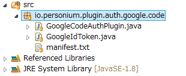
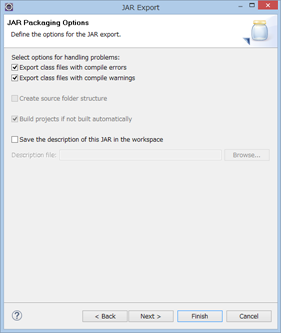

Personium Authentication Plugin Developer Manual
======

This is a document of  **Personium** Authentication Plugin Developer Manual.

Documents
------

　It describes the information necessary for developing Personium's Authentication plugin.
　This document explains the procedure for creating Authentication plugin.

## Purpose of Authentication Plugin

　The Authentication plugin performs OAuth 2.0 implementation based on OpenID Connect (OIDC) specification for authentication processing to each provider.

```sequence
Client->Resource Ower:(A)Authorization Request
Resource Ower-->Client:(B)Authorization Grant
Client->Authentication Server:(C)Authorization Grant
Authentication Server-->Client:(D)Access Token
Client->Resource Server:(E)Access Token
Resource Server-->Client:(F)Protected Resource
```

(A)The client issues an authorization request (Authorization Request) to the resource owner.
(B)The resource owner sends an authorization grant to the client as a reply indicating permission of the authorization request.
(C)The client requests an access token by sending an authorization grant to the authorization server.
(D)The authorization server verifies the authenticity of the client and the validity of the authorization grant, issues an access token if there is no problem.
(E)The client authenticates with the access token, thereby requesting access to the protected resource.
(F)If the access token is valid, accept the client's request.

---

　The following is an example using the google version Authentication Plugin.

## Class structure of Plugin

The border part of the creation plug-in is created.

The class structure diagram of Authentication Plugin is shown below.


> **Note:**  Return value of authentication processing
> - If authentication succeeds, AutheticatedUser is returned.
> - If authentication fails, a DcCoreAuthException is thrown.

## Plugin Behavior

The operation of Authentication Plugin is shown below.


　1. Plugin initialization processing
　   Plugin Manager is called in the DcCoreApplication class and reads all plugins.

　2. Call authentication process
　   In the TokenEndPointResouce class, select the target GrantType Plugin.
　   Execute the authenticate method of the selected plugin.

> **Note:**
> - Personium Plugin can be executed simply by placing it in the Plugins folder.
> - The Authenticate Plugin specifies each provider for "Auth" and GrantType as Type, and by writing the authenticate method, the target plugin is selected and the authenticate method is executed.

### 1.Plugin initialization processing
####<i class="icon-file"></i>DcCoreApplication.java
```
public class DcCoreApplication extends Application {
    private static PluginManager pm;
    static {
        try {
            TransCellAccessToken.configureX509(DcCoreConfig.getX509PrivateKey(), DcCoreConfig.getX509Certificate(),
                    DcCoreConfig.getX509RootCertificate());
            LocalToken.setKeyString(DcCoreConfig.getTokenSecretKey());
            pm = new PluginManager();
        } catch (Exception e) {
            DcCoreLog.Server.FAILED_TO_START_SERVER.reason(e).writeLog();
            throw new RuntimeException(e);
        }
    }
```
　pm = new PluginManager();
　Generate the PluginManager class.

---
### 2.Call authentication process
####<i class="icon-file"></i>TokenEndPointResource.java
```
            PluginManager pm = DcCoreApplication.getPluginManager();    // Plugin manager.
            PluginInfo pi = pm.getPluginsByGrantType(grantType);        // Search target plug-in.
            if (pi == null) {                                           // Plug-ins do not exist.
                throw DcCoreAuthnException.UNSUPPORTED_GRANT_TYPE.realm(this.cell.getUrl());
            }
            try {
                // Invoke the plug-in function.
                Map<String, Object> body = new HashMap<String, Object>();
                body.put(AuthConst.KEY_TOKEN, idToken);

                Object plugin = (Plugin) pi.getObj();
                AuthenticatedUser au = ((AuthPlugin) plugin).authenticate(cell, body);
                if (au != null) {
                    String account = au.getAttributes(AuthConst.KEY_ACCOUT);
                    if (account != null) {
                        // When processing is normally completed, issue a token.
                        return issueIdToken(target, dcOwner, schema, account, idToken, host);
                    }
                }
            } catch (DcCoreAuthnException e) {
                throw DcCoreAuthnException.UNSUPPORTED_GRANT_TYPE.realm(this.cell.getUrl());
            }
```
---
## Procedure for creating plugin

　Follow the steps below to create a plugin.

　1. Create Java Source Program
　2. Create manifest File
　3. Export jar File
　4. Setting jar File
　5. Test & debug the Plugin

---
###  1. Create Java Source Program

　The Java source program of the Authentication plugin consists of two program files: ** Authentication base plugin ** which is the basis of the Authentication Plugin and unique processing ** Authentication specific processing **.

　Copy these two files and replace all parts marked ** GoogleCode · google · code ** with the name of the Authentication plugin you will create.

---
Authentication base plugin
####<i class="icon-file"></i> **GoogleCodeAuthPlugin.java**
```
/**
 * personium.io
 * Copyright 2016 FUJITSU LIMITED
 *
 * Licensed under the Apache License, Version 2.0 (the "License");
 * you may not use this file except in compliance with the License.
 * You may obtain a copy of the License at
 *
 *     http://www.apache.org/licenses/LICENSE-2.0
 *
 * Unless required by applicable law or agreed to in writing, software
 * distributed under the License is distributed on an "AS IS" BASIS,
 * WITHOUT WARRANTIES OR CONDITIONS OF ANY KIND, either express or implied.
 * See the License for the specific language governing permissions and
 * limitations under the License.
 */
package io.personium.plugin.auth.google.code;

import java.util.Map;

import com.fujitsu.dc.core.DcCoreAuthnException;
import com.fujitsu.dc.core.auth.IdToken;
import com.fujitsu.dc.core.auth.OAuth2Helper.Key;
import com.fujitsu.dc.core.model.Cell;
import com.fujitsu.dc.core.plugin.auth.AuthPlugin;
import com.fujitsu.dc.core.plugin.auth.AuthConst;
import com.fujitsu.dc.core.plugin.auth.AuthenticatedUser;

public class GoogleCodeAuthPlugin implements AuthPlugin {
    /** to String. **/
    public static final String PLUGIN_TOSTRING = "Google Code Flow Authentication";

    /** urn google grantType. **/
    public static final String PLUGIN_GRANT_TYPE = "urn:x-dc1:oidc:google:code";

	/**
	 * getType.
	 * @return String
	 */
	public String getType() {
		return AuthConst.TYPE_AUTH;
	}

	/**
	 * getGrantType.
	 * @return String
	 */
	public String getGrantType() {
		return PLUGIN_GRANT_TYPE;
	}

	/**
	 * toString.
	 * @return String
	 */
	public String toString(){
        return PLUGIN_TOSTRING;
    }

	/**
	 * authenticate.
	 * @return au AuthenticatedUser
	 */
    public AuthenticatedUser authenticate(Cell cell, Map <String, Object> body){
    	AuthenticatedUser au = null;
		if (cell != null && body != null) {
	    	// check idToken
			String idToken = (String)body.get(AuthConst.KEY_TOKEN);
	    	IdToken idt = verifyIdToken(cell, idToken);

	    	// authenticate google
			au = GoogleCodeAutheticate.authenticate(cell, idt);
		}
		return au;
    }

    private IdToken verifyIdToken(Cell cell, String idToken){
       	// id_tokenのCheck処理
        if (idToken == null) {
        	throw DcCoreAuthnException.REQUIRED_PARAM_MISSING.realm(cell.getUrl()).params(Key.ID_TOKEN);
        }
        // id_tokenのパース
        IdToken idt = IdToken.parse(idToken);
        // exp で Token の有効期限切れの確認(Tokenに有効期限(exp)があるかnullチェック)

        if (idt.getExp() == null) {
        	throw DcCoreAuthnException.OIDC_INVALID_ID_TOKEN.params("ID Token expiration time null.");
        }

        // Tokenの検証。検証失敗の場合 DcCoreAuthnExceptionがthrowされる
        idt.verify();

        return idt;
    }
}
```
　If IdToken validation is successful, call the authenticate method.
　If Authentication is normal, it returns AuthenticatedUser.

---
Authentication specific processing
####<i class="icon-file"></i> **GoogleCodeAutheticate.java**　
```
/**
 * personium.io
 * Copyright 2016 FUJITSU LIMITED
 *
 * Licensed under the Apache License, Version 2.0 (the "License");
 * you may not use this file except in compliance with the License.
 * You may obtain a copy of the License at
 *
 *     http://www.apache.org/licenses/LICENSE-2.0
 *
 * Unless required by applicable law or agreed to in writing, software
 * distributed under the License is distributed on an "AS IS" BASIS,
 * WITHOUT WARRANTIES OR CONDITIONS OF ANY KIND, either express or implied.
 * See the License for the specific language governing permissions and
 * limitations under the License.
 */
package io.personium.plugin.auth.google.code;

import com.fujitsu.dc.core.DcCoreAuthnException;
import com.fujitsu.dc.core.DcCoreLog;
import com.fujitsu.dc.core.auth.IdToken;
import com.fujitsu.dc.core.model.Cell;
import com.fujitsu.dc.core.odata.OEntityWrapper;
import com.fujitsu.dc.core.plugin.auth.AuthenticatedUser;
import com.fujitsu.dc.core.DcCoreConfig.OIDC;
import com.fujitsu.dc.core.auth.AuthUtils;

public class GoogleCodeAutheticate {
    /**
     * Google URL
     */
    public static final String URL_HTTPS = "https://";
    public static final String URL_ISSUER = "accounts.google.com";

    /**
     * Type値 oidc:google.
     */
    public static final String TYPE_VALUE_OIDC_GOOGLE = "oidc:google";

    /**
     * can not constructor.
     */
    private GoogleCodeAutheticate() {
    }

	/**
     * Google Authentication Process.
     * @param cell Cell
     * @param idt idToken
     * @return
     */
    public static AuthenticatedUser authenticate(Cell cell, IdToken idt) {
        String mail = idt.getEmail();
        String aud  = idt.getAudience();
        String issuer = idt.getIssuer();

        // Googleが認めたissuerであるかどうか
        if (!issuer.equals(URL_ISSUER) && !issuer.equals(URL_HTTPS + URL_ISSUER)) {
            DcCoreLog.OIDC.INVALID_ISSUER.params(issuer).writeLog();
            throw DcCoreAuthnException.OIDC_AUTHN_FAILED;
        }

        // Googleに登録したサービス/アプリのClientIDかを確認
        // DcConfigPropatiesに登録したClientIdに一致していればOK
        if (!OIDC.isGoogleClientIdTrusted(aud)) {
        	throw DcCoreAuthnException.OIDC_WRONG_AUDIENCE.params(aud);
        }

        // このユーザー名がアカウント登録されているかを確認
        // IDtokenの中に示されているAccountが存在しない場合
        OEntityWrapper idTokenUserOew = cell.getAccount(mail);
        if (idTokenUserOew == null) {
            // アカウントの存在確認に悪用されないように、失敗の旨のみのエラー応答
        	DcCoreLog.OIDC.NO_SUCH_ACCOUNT.params(mail).writeLog();
            throw DcCoreAuthnException.OIDC_AUTHN_FAILED;
        }

        // アカウントタイプがoidc:googleになっているかを確認
        // Account があるけどTypeにOidCが含まれていない
        if (!AuthUtils.getAccountType(idTokenUserOew).contains(TYPE_VALUE_OIDC_GOOGLE)){
            //アカウントの存在確認に悪用されないように、失敗の旨のみのエラー応答
            DcCoreLog.OIDC.UNSUPPORTED_ACCOUNT_GRANT_TYPE.params(TYPE_VALUE_OIDC_GOOGLE, mail).writeLog();
            throw DcCoreAuthnException.OIDC_AUTHN_FAILED;
        }

        // 正常な場合のみトークンの発行が可能
        AuthenticatedUser au = new AuthenticatedUser();
        // アカウント名の設定
        au.setAccountName(mail);

        return au;
    }
}
```
　Write the authentication process specific to the authenticate method.

---
### 2. Create Manifest File

　** To generate the jar file **, create a manifest.txt file.
#### <i class="icon-file"></i>**manifest.txt**
```
Manifest-Version: 1.0
Plugin-Class: io.personium.plugin.auth.google.code.GoogleCodeAuthPlugin
```
Write the information to create the jar file.
Plugin - Class is the format of package + class name.

---
### 3. Export jar File

####<i class="icon-file"></i>GoogleCodeAuthPlugin.jar

Create a jar file using Eclipse.

1) Select the created plug-in and click "Export ..." in the menu displayed by right-clicking.



2) Select "Java - JAR file" and click "Next>".


3) Specify the path and name of the Jar file you want to create and click "Next>".


4) Click "Next>".


5) Specify the manifest file and click "Finish".

A Jar file is created in the specified path.

---
### 4. Setting jar File
####<i class="icon-hdd"></i>dc-config.propertie
```
# general configurations
io.personium.core.plugin.path=/dc1-core/plugins
```
Place the created jar file in the path of the plugins folder set in the dc - config.propertie file.

---
### 5. Test & debug the Plugin

#### <i class="icon-file"></i>**PluginTest.java**
com.fujitsu.dc.test.core.plugin

The final step is testing and debugging.
To test this plugin with junit, add a test processing method to PluginTest.java.
Execute the created junit and confirm that the operation ends normally.

---

  [1]: http://personium.io/
  [2]: http://personium.io/docs/
  [3]: https://github.com/personium/
  [4]: http://openid.net/
  [5]: https://oauth.net/
