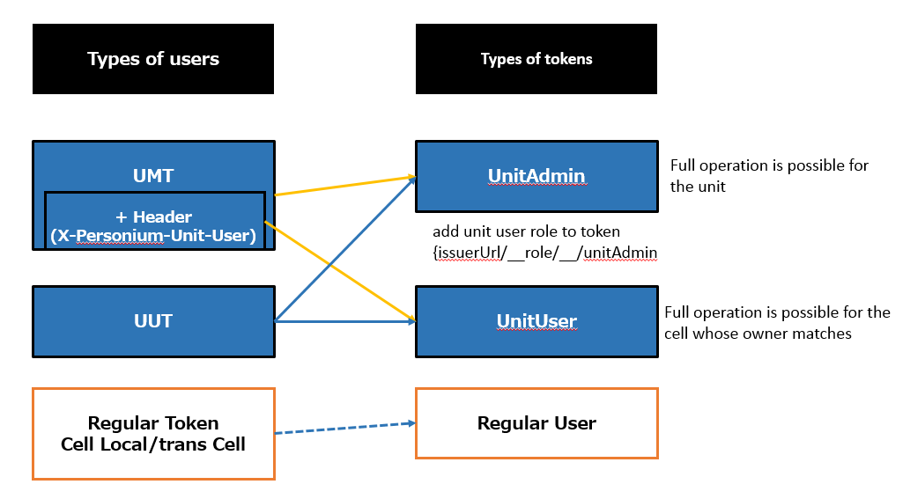

# Unit user
## What is a unit user?
A unit user is an entity that operates a unit level API such as CRUD of a cell.  
The unit user performs API access using a unit user token (Unit User Token (UUT)) or a unit master token (Unit Master Token (UMT))

### Unit User Token (Unit User Token (UUT))
UUT plays a big role when providing Personium as a service, but Personium can operate with only UMT without using UUT.  
The biggest motivation for service providers to use UUT is to manage billing destinations of cells at once.  
That is, by having the service provider issue a different UUT to each customer himself and using this to access the cell CRUD API, the following is realized.

     When creating a cell, a cell is created with information that it is owned.
     When searching for a cell, it is not searched except for the cell it created.
     When deleting a cell, deletion other than the cell created by itself fails.

On the other hand, if an individual or organization has its own dedicated unit, all the cells created in that unit will be managed by himself, so the above function is unnecessary.  
In that case, you can use UMT instead of UUT for operation.

Unit users have identifiers, which are called unit user names.  
The unit does not have a unit user name management mechanism, and it assumes the existence of an external management mechanism.



## Owner attribute of unit level control entity (cell)

A cell has a hidden attribute called an owner.  
The hidden attribute can not confirm the content from the OData format API, but it is an attribute that exists in all cells.  
Another example of the hidden attribute is the account of the cell control entity.  
For account, an attribute that stores a password hash named hashedCredential is defined.

The owner can not change when setting it at cell creation.

## Type of unit user

### Unit Admin (Unit Admin)

Users who can operate units

### Unit User (Unit User)

A user who can perform operations on the cell whose owner matches.  
When searching the cell, only the cell whose owner matches can be searched

## Type of Unit Token

### Unit Master Token (Unit Master Token (UMT))

Unique token in the unit, accessing with this token will be treated as Unit Admin.  
Set arbitrary character string to "io.personium.core.masterToken =" in personium-unit-config.properties.  
By specifying an arbitrary character string in the X-Personium-Unit-User header, it is also possible to move as a unit user whose unit user name is the character string.

An example

Create a cell with the unit user name of {UnitURL}/{UnitUserName} as its owner

```sh
curl "{UnitURL}/__ ctl/Cell" - X POST \
-H "Authorization: Bearer token" \
-H "X-Personium-Unit-User: {UnitURL}/{UnitUserName}" \
-d '{"Name": "cell1"}'
```

Get cell list with unit user name "{UnitURL}/{UnitUserName}" as its owner

```sh
curl "{UnitURL}/__ ctl/Cell" - X GET \
-H "Authorization: Bearer token" \
-H "X-Personium-Unit-User: {UnitURL}/{UnitUserName}"
```

### Unit User Token (Unit User Token (UUT))

UUT is a Bearer token of OAuth 2 based on the SAML Assertion with the following information.

| Element/attribute name | Contents |
|:--|:--|
| IssueInstant | Authentication time |
| issuer | URL admitted by the unit. <br> describe arbitrary URLs allowed in "io.personium.core.unitUser.issuers =" in personium-unit-config.properties |
| Subject \ NameID | unit user name. Any string. |
| audience | Unit root URL |
| attribute | Unit User Role |


The access agent issuing this token is called a unit user, and the authentication process that issues such SAML assertion is called unit user authentication.

Also, the transcell token issued by giving the root URL of the unit to p_target in the Account authentication in the cell satisfies the requirements of the UUT,
By including the URL of a specific cell in the setting of the unit, the cell can be a UUT issuer.

An example  
When issuing a UUT in a cell  
Set `io.personium.core.unitUser.issuers={UnitURL}/{Cell}/` in personium-unit-config.properties

```sh
curl "{UnitURL}/{Cell}/__ token" -X POST \
-d 'grant_type = password & username = user & password = pass & p_target = {UnitURL} /'
```

io.personium.core.unitUser.issuers can set multiple URLs.

UUT usually does not have access authority other than CRUD of Cell.
When you want to manipulate the contents of Cell, it is necessary to give unit user role (CellContentsReader, CellContentsAdmin) to be described later.

### Unit User Role

personium - core recognizes the following as the role of the unit user.  
Even if other roles are granted within Token, it is not recognized. (ignore)

#### UnitAdmin Role

{UnitURL}/{Cell}/\_\_role/\_\_/UnitAdmin

If the UnitAdmin role is granted, that user becomes Unit Admin.  
In V 0, the master token was abused for various unit management tasks, but such operation is undesirable from the viewpoint of security. <br>
For various unit management tasks, API calls should be made using the token of this role.

#### CellContentsReader Role

{UnitURL}/{Cell}/\_\_role/\_\_/CellContentsReader

If the CellContentsReader role has been granted, the Unit User Token for that user has read permission on the contents of Cell.  

#### CellContentsAdmin Role

{UnitURL}/{Cell}/\_\_role/\_\_/CellContentsAdmin

If the CellContentsAdmin role has been granted, the Unit User Token for that user has read and write permissions on the contents of Cell.  
By assigning "UnitAdmin role" and "CellContentsAdmin role" to the unit user, the Unit User Token of that user becomes equivalent to the Unit Master Token.
